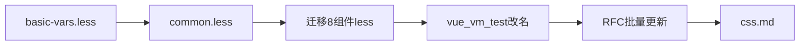

# CSS Token / Mixin / 类名前缀统一

## 现状结论

- 8 个组件：button / input / text-area / checkbox / radio / tag / alert / link
- [`basic-vars.less`](packages/vai/src/theme/basic-vars.less)、[`common.less`](packages/vai/src/theme/common.less) 已存在但为空；组件 less **无** `@import` theme
- 色板已是同一套 Tailwind 系 hex（如 `#1f2937`、`#16a34a`），但每个 less 文件各自复制
- 类名实际为 **`sc-`（连字符）**，非 `sc_`：如 `.sc-btn`、`.sc-plain-btn`、`.sc-btn__loading`
- `st-*`（尺寸/主题/禁用）、`is-*`（布尔态）保持不变；`vai-popper` 暂不动

## 默认决策（已选定）

| 项         | 决策                                                                                                                                              |
| ---------- | ------------------------------------------------------------------------------------------------------------------------------------------------- |
| 类名替换   | `sc-` → `v-`，其余结构不变：`sc-plain-btn` → `v-plain-btn`，`sc-btn__loading` → `v-btn__loading`                                                  |
| 修改范围   | 8 个组件的 less / vue / vm / 测试 + 对应 RFC；其余未实现 RFC 中的 `sc-*` 类名一并批量改为 `v-*`（命名约定同步）                                   |
| 视觉差异   | **保留**现有差异（如 checkbox/radio focus-ring 40% vs 其他 35%；disabled 0.5 vs 0.55），用不同 token 表达，不强行统一成同一数值                   |
| 主题 mixin | 抽取布局 / focus-halo / disabled / plain / overlay-input 等；主题色块以 `var(--v-*)` 替换硬编码，**不强行**合并成会改变各组件变量映射的巨型 mixin |
| 暗色主题   | 本次只建 `:root` token；css.md 写明可通过覆盖 `--v-*` 做主题定制，不实现完整 dark scheme                                                          |

---

## 1. 写入 [`basic-vars.less`](packages/vai/src/theme/basic-vars.less)

全部挂在 `:root { }`，前缀 `--v-`，分组：

**Color（中性 + 语义）**

- 灰阶：`--v-color-gray-50` … `--v-color-gray-950`、`--v-color-white`
- 语义：`--v-color-success` / `-border` / `-hover` / `-pressed`（info / warn / error 同理）
- control / dark 映射到灰阶（与 button 现有值对齐）
- mix 比例：`--v-mix-plain-bg: 12%`、`--v-mix-focus-ring: 35%`、`--v-mix-focus-ring-strong: 40%` 等

**Size**

- `--v-font-family`、`--v-font-size-sm|md|lg`、`--v-line-height-tight|normal`、`--v-font-weight-medium`
- `--v-control-height-sm|md|lg`、`--v-check-size-sm|md|lg`
- `--v-radius-xs` … `--v-radius-pill`、`--v-border-width*`、`--v-focus-ring-width`

**Space**

- `--v-space-1` … `--v-space-10`（覆盖现有 3/4/6/8/10/12/14/16/18/20px）

**Motion / state**

- `--v-duration-fast`、`--v-duration-focus`、`--v-ease-*`
- `--v-opacity-disabled` / `-light` / `-muted`

组件内继续用局部 alias（如 `--btn-bg: var(--v-color-gray-100)`），不把组件专属变量提升到 `:root`。

---

## 2. 充实 [`common.less`](packages/vai/src/theme/common.less)

```less
@import "./basic-vars.less";
```

抽取并加注释（用途 + 配合方式）的 mixin / 公共规则，至少包括：

| 名称                                                                            | 用途                                                                                             |
| ------------------------------------------------------------------------------- | ------------------------------------------------------------------------------------------------ |
| `.v-inline-flex-center()`                                                       | `display: inline-flex; align-items/justify-content: center` + `box-sizing`（对应 button L24–26） |
| `.v-font-base()`                                                                | 统一 `font-family`                                                                               |
| `.v-transition-colors()`                                                        | 标准 0.15s 颜色/阴影过渡                                                                         |
| `.v-disabled()`                                                                 | opacity + `not-allowed`                                                                          |
| `.v-plain-surface(@color)`                                                      | `color-mix(..., 12%, transparent)` 浅底（button/tag plain、alert 浅底）                          |
| `.v-overlay-input()`                                                            | checkbox/radio 透明叠层原生 input                                                                |
| `.v-focus-interactive(@ring)` + 统一 `@keyframes v-focus-halo` / `v-focus-wave` | 合并 button/checkbox/radio/link 四套重复动画                                                     |
| `.v-focus-ring-static(@color)`                                                  | input/textarea 的静态 `box-shadow: 0 0 0 3px`                                                    |

复杂 mixin 上方用中文块注释说明：何时调用、需要哪些 CSS 变量、与 `st-*` 如何配合。

各组件 less 顶部增加：

```less
@import "../../theme/common.less";
```

---

## 3. 迁移 8 个组件样式

对每个 `*.less`：

1. 硬编码 hex / 重复尺寸 → `var(--v-*)`
2. 能用 mixin 的布局 / focus / disabled / plain / overlay → 调用 mixin
3. 选择器与 keyframes：`sc-` → `v-`（含 `__` 元素、变体类、动画名）

组件级 CSS 变量命名可保留 `--btn-*` / `--input-*` 等前缀（内部实现细节），仅公共 token 用 `--v-`。

同步改：

- `*.vue` 模板 class
- `*.vm.ts` 中动态类（如 `"sc-plain-btn"` → `"v-plain-btn"`）
- `__test__/*.test.ts` 中的类名断言与选择器
- 对应 RFC：[`packages/rfcs/form/button.md`](packages/rfcs/form/button.md) 等 8 份文档中的 `sc-*` → `v-*`；「scene-theme 类名」表述改为组件类名 `v-*`
- 未实现 RFC：批量将文档里的 `sc-xxx` 规划类名改为 `v-xxx`（避免规范与实现分叉）

`apps/site` 当前无直接 `sc-` 字符串，一般无需改 demo（组件内部已换类名）。

---

## 4. 更新 [`.cursor/.rules/css.md`](.cursor/.rules/css.md)

在现有 3 条原则上扩展为可执行规范，建议章节：

1. **Token**：`--v-` 前缀；颜色 / size / space / motion；定义在 `theme/basic-vars.less` 的 `:root`；禁止组件内再写裸 hex（图标 SVG data URI 等例外）
2. **主题色**：`control | dark | success | info | warn | error`；色值以 button 为权威来源；表单组件统一 sm/md/lg
3. **类名约定**：
   - 组件根 / 变体 / 元素：`v-{name}`、`v-{variant}-{name}`、`v-{name}__{el}`
   - 状态：`st-*`（尺寸、主题、disabled、pressed）
   - 布尔 UI：`is-*`
4. **公共样式**：优先用 `common.less` mixin；新增重复规则先抽公共再写组件
5. **Focus**：`:focus-visible` 用 halo；鼠标点击用 wave；ring 用 `color-mix` + `--v-mix-focus-ring*`
6. **引入方式**：组件 less `@import` `common.less`（自动带上 basic-vars）
7. **主题定制**：覆盖 `:root` 的 `--v-*` 即可换肤；暗色主题通过覆盖同一组变量实现

---

## 实施顺序



验证：跑相关组件单测（button / input / text-area / checkbox / radio / tag / alert / link），确认类名断言与样式引用无残留 `sc-`。

---

## 关键文件

- 新增内容：[`packages/vai/src/theme/basic-vars.less`](packages/vai/src/theme/basic-vars.less)、[`packages/vai/src/theme/common.less`](packages/vai/src/theme/common.less)
- 改样式：8 个 `packages/vai/src/components/**/*.less`
- 改绑定：对应 `*.vue` / `*.vm.ts` / `__test__/*.ts`
- 改文档：8 个已实现 RFC + 其余 RFC 中 `sc-*` 类名；[`.cursor/.rules/css.md`](.cursor/.rules/css.md)
- 不动：[`popper.less`](packages/vai/src/theme/popper.less)（仍用 `vai-popper`）
