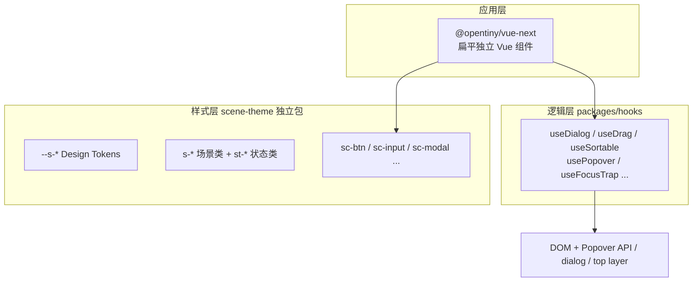

# @opentiny/vue-next 组件分类与命名体系

## 架构分层（与现有工程对齐）

| 层 | 包 | 职责 |
|---|---|---|
| 样式 | [`scene-theme`](e:/tiny-vue-next/tvp-vue/packages/scene-theme) | CSS vars → mixin → 原子类 → 场景类；**与 Vue 解耦**，可被其他 UI 库复用 |
| 逻辑 | [`packages/vue-next-hooks`](e:/tiny-vue-next/tvp-vue/packages/vue-next-hooks)（`@opentiny/vue-next-hooks`） | 弹窗、拖拽、排序、虚拟滚动、焦点陷阱等；入参 = `HTMLElement` + options |
| 组件 | [`packages/vue-next`](e:/tiny-vue-next/tvp-vue/packages/vue-next)（`@opentiny/vue-next`） | 全部组件从单包导出；**UI = f(state + props)**，少命令式 DOM 操作 |
| RFC | [`tvp-vue/rfcs`](e:/tiny-vue-next/tvp-vue/rfcs) | 每个组件/hook 一份设计文档，实现前完善 |

### 组件 API 原则（已确认）

- **扁平独立组件**：不做 `Card.Header` 式 compound；需要拆分时导出独立组件（如 `Select` + `Option`）
- **Slot 优先**：布局型区域（Dialog 标题/内容/底部）优先用 named slot，仅在需跨组件复用时才抽独立组件（如 `DialogHeader`）
- **CSS 映射**：Vue 组件默认挂载对应 `sc-*` 类名，props 驱动 `st-*` 状态类

### 跨组件通用外观 Props

大多数**表单控件**与**基础元素类组件**（Button、Input、Checkbox、Radio、Switch、Select、Tag 等）共享以下外观 props；布局/容器类组件（Grid、Card、Dialog 等）按需支持，不强制。

#### `size` — 尺寸

| 值 | 说明 | CSS 映射 |
|---|---|---|
| `lg` | 大号 | `st-lg` |
| `md` | 中号（**默认**） | `st-md` |
| `sm` | 小号 | `st-sm` |

- 可通过 `ConfigProvider` 设置全局默认 `size`
- 映射 `--sv-fs-*` / `--sv-pad-*` 等 token（与 scene-theme `@sizeList` 一致）

#### `theme` — 语义主题色

| 值 | 说明 | CSS 映射 |
|---|---|---|
| `success` | 成功 | `st-success` |
| `info` | 信息 | `st-info` |
| `warn` | 警告 | `st-warn` |
| `error` | 错误 | `st-error` |

- **主题色（默认）**：色彩**浓**，实色背景 + 反色文字（scene-theme：`sc-theme-*` / `sc-livebg` + `sc-whitetxt`）
- **朴素（plain）**：对应 theme 的**淡色**版本，浅背景 + 主题色文字/边框（`plain` prop 或 `variant="plain"` → `st-plain` + `sc-plain-*`）
- **幽灵（ghost）**：**无背景**（透明），仅保留主题色文字与边框；hover/active 时也不填充实色背景（`ghost` prop → `sc-ghost-*`，`background-color: transparent`）

#### control 色 — 中性控件色

- 适用于 Button、Checkbox、Radio、Switch、Input 边框等**无明确语义**的默认态
- 视觉参考：Windows 下原生控件的**灰色**（scene-theme：`sc-ctrltxt` / `sc-ctrlbg` / `sc-ctrlbd`）
- 与 `theme` 互斥：`theme` 有值时走语义色，无值时走 control 色

#### 外观变体组合示例（以 Button 为参照）

| 场景 | props 示意 | scene-theme 类名 |
|---|---|---|
| 默认灰色按钮 | （无 theme） | `sc-btn` |
| 成功主题按钮 | `theme="success"` | `sc-theme-btn` + `st-success` |
| 成功朴素按钮 | `theme="success" plain` | `sc-plain-btn` + `st-success` + `st-plain` |
| 成功幽灵按钮 | `theme="success" ghost` | `sc-ghost-btn` + `st-success` |
| 小号禁用 | `size="sm" disabled` | `st-sm` + `st-disabled` |

> RFC 编写约定：
> - 各组件 Props 表须列出支持的 `size` / `theme` / `plain` / `ghost` / `disabled` 及与 `st-*` 的映射；不支持的变体明确标注「不适用」。
> - **不在 Props 中声明 `class` / `style`**：Vue 自动透传至根元素；仅深层 DOM 需定制时暴露语义化 prop（如 `tableBodyClass`、`bodyStyle`）。
### 命名规范

| 类型 | 规范 | 示例 |
|---|---|---|
| Vue 组件 | PascalCase，单包导出 | `Button`, `DateRangePicker` |
| 关联子组件 | 独立 PascalCase 组件 | `Select` + `Option`；`Tabs` + `Tab` + `TabPanel` |
| CSS 场景类 | `sc-{简称}` | `Button` → `sc-btn` |
| CSS 状态类 | `st-{语义}` | `size="sm"` → `st-sm`；`theme="success"` → `st-success`；`plain` → `st-plain`；`ghost` → 场景类 `sc-ghost-*` |
| Hooks | `use{Capability}` | `useDialog`, `useSortable` |
| 服务式 API | `create{Thing}` 或 `use{Thing}()` | `createToast()`, `useToast()` |

### 去重边界（避免组件功能重叠）

| 只保留 | 合并/废弃 | 边界说明 |
|---|---|---|
| `Dialog` | Modal, MessageBox | 基于原生 `<dialog>` + top layer；AlertDialog 是语义变体非重复 |
| `AlertDialog` | Popconfirm | 破坏性/不可逆确认；轻量 inline 确认用 `Confirm` |
| `Confirm` | Popconfirm, MessageBox | 行内/浮层确认，不等同 Dialog |
| `Drawer` | Sheet | 侧滑面板；`placement` prop 区分方向，不另设 Sheet |
| `Toast` | Message | 轻量 transient 提示 |
| `Notification` | — | 带标题/操作/持久化的重通知 |
| `Tag` | Chip | 可关闭标签；Badge 只管计数/状态点 |
| `Badge` | — | 数字/圆点，不做文本标签 |
| `Accordion` | Collapse | 多面板手风琴 |
| `Collapsible` | Disclosure | 单块折叠 primitive |
| `Divider` | Separator | 可选文字的分割线 |
| `Combobox` | Autocomplete（可选） | 可输入+过滤+选择；纯联想输入后期按需加 `Autocomplete` |
| `Spinner` | Spin, Loading | 内联不确定进度；全屏遮罩用 `LoadingOverlay` |
| `ProgressBar` | Progress | 确定进度条 |
| `ProgressCircle` | — | 环形进度 |
| `Meter` | — | 已知范围度量（区别于 Progress） |
| `TextField` | — | Label+Input+Error 组合态；`Input` 仍是 primitive |
| `DataTable` | VirtualizedTable | 高级表格模式，基础 `Table` 不内置虚拟化 |

---

## 组件分类与完整名称清单

### 1. Foundation 基础（8）

全局配置与文本原语，不含业务交互。

| 组件名 | 说明 | scene-theme 类名 |
|---|---|---|
| `ConfigProvider` | 主题/方向/尺寸/无障碍上下文 | — |
| `Icon` | 图标容器（尺寸/颜色语义） | `sc-icon` |
| `Typography` `markdown-view` | 标题/段落/文本样式，  与markdown-View 合并。 markdown 也支持标题，加粗， 链接，删除等。 到时候这些组件进行统一 | -  |
| `Link` | 超链接 | `sc-link` |
---

### 2. Layout 布局（12）

纯结构与空间，不含数据或交互逻辑。

| 组件名 | 说明 |
|---|---|
| `Container` | 最大宽度居中容器, 原则上每个应用只使用一次， 它使用display:grid布局来实现 |
| `Grid` | CSS Grid 容器，支持gap, 与拖拽布局，保存布局为 modelValue中  |
| `Flex` | Flex 布局容器 |
| `Row` | 水平栅格行 |
| `Col` | 栅格列 |
| `Space` | 子元素间距 |
| `Divider` | 分割线（可选文字） |
| `Affix` | 吸顶/吸底 有相对父元素，否则相对于body |
| `Splitter` | 面板分割器 ,使用display:grid 来实现|
| `Card` | 卡片容器 | — |
| `Carousel` | 轮播 | `CarouselItem` |
| `Accordion` | 多面板手风琴 | `AccordionItem` |
| `Collapsible` | 单块折叠 |
---

### 3. Navigation 导航（13）

页面级/区域级导航，不含表单选择。

| 组件名 | 说明 | 关联独立组件 |
|---|---|---|
| `Menu` | 导航菜单容器 | `MenuItem`, `MenuGroup`, `SubMenu` |
| `DropdownMenu` | 通用下拉菜单（非导航栏）操作浮层 | `DropdownMenuItem`, `DropdownMenuGroup` |
| `Breadcrumb` | 面包屑 | `BreadcrumbItem` |
| `Tabs` | 选项卡 | `Tab`, `TabPanel` |
| `Steps` | 流程步骤, 类似于tabs的功能， 不同step要显示不同的内容 | `Step` |
| `Pagination` | 分页 | — |
| `Anchor` | 锚点导航 | `AnchorLink` |

---

### 4. Form & Input 表单录入（34）

数据输入与提交；primitive 与 field 分层，避免 Input/TextField 重复。

| 组件名 | 层级 | 说明 |
|---|---|---|
| `Form` | 容器 | 表单上下文、校验状态 |
| `FormItem` | 容器 | 单字段布局（label + control + error） |
| `Button` | 控件 | 按钮, 支持切换状态 |
| `ButtonGroup` | 容器 | 按钮组， 与toolbar功能重复, 可以垂直方向 |

| `Input` | primitive | 单行输入, 包括autocomplete， 前后缀图标  Mention@功能 |
| `TextArea` | primitive | 多行输入 Mention@功能|
| `InputOTP` | 控件 | 验证码等连续多位输入， delete回退 |
| `InputTag` | 控件 | 标签式多值输入，回车后，留下一个标签，可删除 |
| `Numeric` | field | 数字输入组合,step, 前后控制按钮 |
| `Checkbox` | 控件 | 复选框 |
| `CheckboxGroup` | 容器 | 复选框组 |
| `Radio` | 控件 | 单选 |
| `RadioGroup` | 容器 | 单选组 |
| `Switch` | 控件 | 开关 |
| `Slider` | 控件 |  滑块 |
| `ProgressBar` | — | 无滑块的线性进度 |
| `Rate` | 控件 | 评分 |
| `SelectCore` | 控件 | 下拉选择的基础功能，其它组件都使用它来实现 |
| `Select` | 控件 | 下拉选择 | `Option`, `OptionGroup`， tree, table 需要设计一套父子通讯的规范。 甚至Cascader 都可以包含一起 |
| `Cascader` | 控件 | 级联选择 |
| `Transfer` | 控件 | 穿梭框 |
| `Upload` | 控件 | 文件上传 |
---

### 5. Date & Time 日期时间（8）

与 Form 分离，因交互复杂且 hooks 独立（`useCalendar`）。

| 组件名 | 说明 |
|---|---|
| `Calendar` | 月历面板 |
| `RangeCalendar` | 范围月历 |
| `DatePicker` | 日期选择 |
| `DateRangePicker` | 日期范围 |
| `TimePicker` | 时间选择 |
| `DateTimePicker` | 日期+时间 |

---

### 6. Data Display 数据展示（22）

只读展示，不含输入/浮层确认。

| 组件名 | 说明 | 关联独立组件 |
|---|---|---|
| `Table` | 基础表格 | `TableColumn`, 排序/筛选/分页高级表格 |
| `List` | 列表 | `ListItem` |
| `VirtualList` | 虚拟列表 | `VirtualListItem` |
| `InfiniteScroll` | 无限滚动容器 | — |
| `Tree` | 树形展示 | `TreeNode` |
| `Tag` | 标签 | — |
| `TagGroup` | 标签组 | — |
| `Badge` | 徽标/计数 | — |
| `Avatar` | 头像 | `AvatarGroup` |
| `Image` | 图片（预览/懒加载） | — |
| `Empty` | 空状态 | — |
| `Timeline` | 时间线 | `TimelineItem` |
| `Tour` | 新手引导 | `TourStep` |
| `QRCode` | 二维码 | — |
| `Watermark` | — | 水印 |
| `Sign` | 手写签名 | — |

---

### 7. Overlay & Feedback 浮层与反馈（21）

浮层、对话框、全局反馈；优先 Popover API / `<dialog>` / top layer。

| 组件名 | 底层 API | 说明 |
|---|---|---|
| `Dialog` | `<dialog>` | 通用模态框， drawer |
| `Popover` | Popover API | 基础的提示功能， 其它都继承它来实现 |
| `Tooltip` | Popover API | 文字提示 |
| `Command` | — | 命令面板 / ⌘K  |
| `Alert` | — | 页内警告条 |
| `Toast` | — | 轻量全局提示 |
| `Loading` | — | 加载指示 |
| `Skeleton` | — | 骨架屏 |

---

### 8. Color System 颜色（6，可选模块）

HeroUI 风格完整取色器，按需引入。 色彩组件比较复杂，待详细研究它的组件

| 组件名 | 说明 |
|---|---|
| `ColorPicker` | 控件 |
| `ColorArea` | 色域面板 |
| `ColorSlider` | 色相/透明度滑条 |
| `ColorSwatch` | 色块 |
| `ColorSwatchPicker` | 色块选择器 |
| `ColorField` | 颜色字段组合 |
| `ColorPicker` | 完整取色器（组合以上） |

---

### 10. Shared Hooks（非组件，逻辑复用清单）

与组件解耦，供多个组件共用：

| Hook | 用于组件 |
|---|---|
| `useDialog` | Dialog |
| `usePopover` | Popover, Tooltip |
| `useFocusTrap` | Dialog, DropdownMenu |
| `useDismiss` | 所有 overlay |
| `useDrag` | Grid, Sortable |
| `useSortable` | List, Table, Transfer |
| `useVirtualizer` | VirtualList |
| `useForm` | Form, 各 Field 组件 |
| `useControllable` | 所有受控/非受控组件 |
| `useId` / `useLabel` | 无障碍 label 关联（FormItem） |
| `useToast` / `createToast` | Toast |
| `useCalendar` | Calendar, DatePicker 系 |
| `useScrollLock` | Dialog |
| `usePresence` | Dialog, Toast, Collapsible |
| `useMediaQuery` | 响应式布局组件 |

---

## 开发优先级

| 阶段 | 数量 | 组件 |
|---|---|---|
| **P0** | 37 | ConfigProvider, Icon, Link, Divider, Card, DropdownMenu, DropdownMenuItem, Breadcrumb, BreadcrumbItem, Tabs, Tab, TabPanel, Pagination, Form, FormItem, Button, Input, TextArea, Checkbox, Radio, RadioGroup, Switch, SelectCore, Select, Option, Table, TableColumn, Tag, Badge, Avatar, Dialog, Popover, Tooltip, Alert, Toast, Loading, Skeleton |
| **P1** | 29 | Typography, Container, Row, Col, Flex, Space, Menu, MenuItem, DropdownMenuGroup, Steps, Step, ButtonGroup, InputOTP, Numeric, CheckboxGroup, ProgressBar, OptionGroup, Upload, Calendar, RangeCalendar, DatePicker, TimePicker, List, ListItem, Tree, TreeNode, Empty, Accordion, AccordionItem |
| **P2** | 25 | Grid, Affix, MenuGroup, SubMenu, Anchor, AnchorLink, InputTag, Rate, Cascader, Transfer, DateRangePicker, DateTimePicker, TagGroup, AvatarGroup, Image, Timeline, TimelineItem, Tour, TourStep, Watermark, Command, ColorPicker, Collapsible, Carousel, CarouselItem |
| **P3** | 按需 | Splitter, VirtualList, VirtualListItem, InfiniteScroll, QRCode, Sign, Color 子系统其余 5 项 |

---

## 与 scene-theme 现有规划的对照

已有样式：[`button.less`](e:/tiny-vue-next/tvp-vue/packages/scene-theme/src/components/button.less)、`icon.less`、`link.less`

规划中待补（[`scene-theme_组件规划`](e:/tiny-vue-next/tvp-vue/packages/scene-theme/scene-theme_组件规划_e00212a9.plan.md)）：input, select, modal, card, tag, badge, avatar, table, tabs, menu, pagination, tooltip, popover, empty, skeleton, toast, alert, drawer, form, steps, tree, collapse

**建议同步策略**：每开发一个 Vue 组件，在 scene-theme 补对应 `sc-*` less；共享场景类（`sc-headrow`, `sc-panel`, `sc-scroll`）已在规划中，Dialog/Card/Drawer 共用。

---

## 下一步（逐个设计时）

对每个 P0 组件产出设计文档，包含：

1. **State 模型**：props + 内部 state 表（UI = f(state)）
2. **通用外观**：`size` / `theme` / `plain` / `ghost` / control 色是否支持及 CSS 映射（见上文「跨组件通用外观 Props」）
3. **Hook 依赖**：复用哪些 hooks
4. **CSS 映射**：sc-* / st-* 类名组合
5. **无障碍**：ARIA role、键盘、focus 管理
6. **动画**：enter/leave 策略（`usePresence`）
7. **现代 API**：是否用 Popover API / dialog / anchor positioning
8. **Web Component 预留**：shadow DOM 边界、custom element 命名（可选 `tvp-button`）

建议从 **Button → Input → Dialog → Select + Option** 四个开始，覆盖 primitive、overlay、复合交互三类模式。
